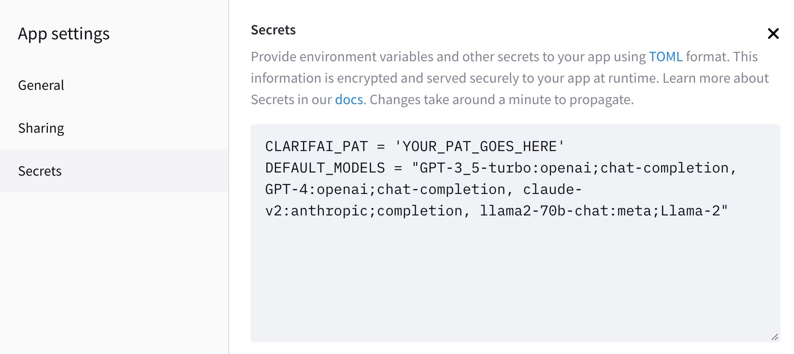
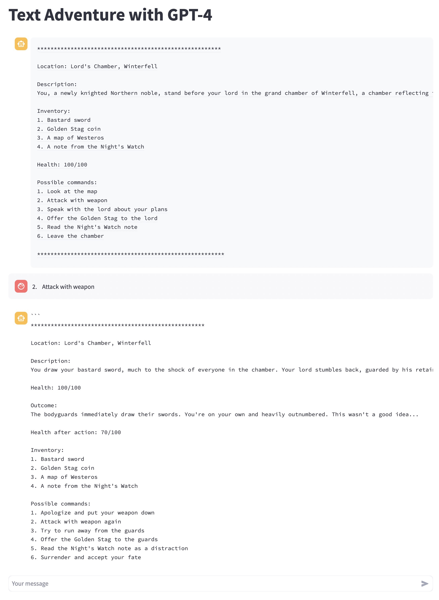
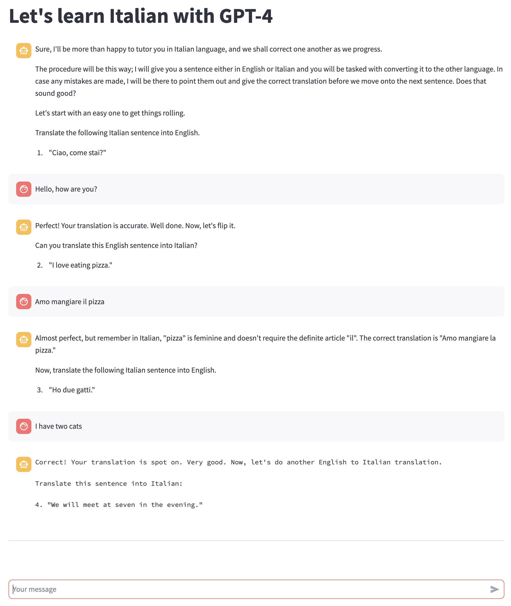
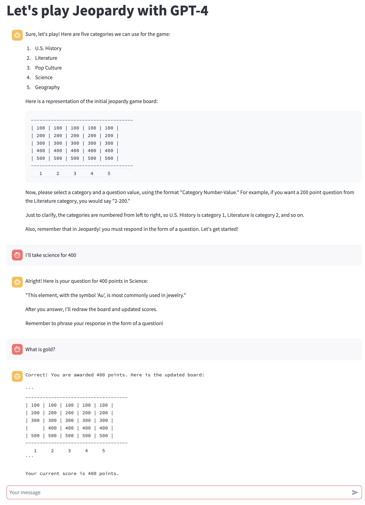

# Headline: Flexible and Easy Conversational AI with Streamlit powered by Clarifai
## By just changing the plain English prompt, quickly experiment with different LLMs and applications

Author: Ian Kelk, Product Marketing Manager, Clarifai

👉 **TLDR:** This blog post showcases how to build an engaging and versatile chatbot using the Clarifai API and Streamlit. **Links:** Here's the [app](https://llm-text-adventure.streamlit.app/) and the [code](https://github.com/iankelk/llm-text-adventure).

This Streamlit app lets you chat with several Large Language Models. It has two main capabilities:
- It proves how powerful and easy it is to integrate models provided by Clarifai using Streamlit & Langchain
- You can evaluate the responses from multiple LLMs and choose the one which best suits your purpose.
- You can see how just by changing the initial prompt to the LLM, you can completely change the entire nature of the app.

https://llm-text-adventure.streamlit.app

## Introduction
Hello, Streamlit Community! 👋 I'm Ian Kelk, a machine learning enthusiast and Developer Relations Manager at Clarifai. My journey into data science began with a strong fascination for AI and its applications, particularly within the lens of natural language processing.

## Problem statement
It can seem intimidating to have to create an entirely new Streamlit app every time you find a new use case for an LLM. It also requires knowing a decent amount of Python and the Streamlit API. What if, instead, we can create completely different apps *just* by changing the prompt? This requires nearly zero programming or expertise, and the results can be surprisingly good. In response to this, I've created a Streamlit chatbot application of sorts, that works with a hidden starting prompt that can radically change its behavour. It combines the interactivity of Streamlit's features with the intelligence of Clarifai's models.

In this post, you’ll learn how to build an AI-powered Chatbot:

Step 1: Create the environment to work with Streamlit locally

Step 2: Create the Secrets File and define the Prompt

Step 3: Set Up the Streamlit App

Step 4: Deploy the app on Streamlit's cloud.


## App overview / Technical details
The application integrates the Clarifai API with a Streamlit interface. Clarifai is known for its superb artificial intelligence models, while Streamlit provides an elegant framework for user interaction. Using a secrets.toml file for secure handling of the Clarifai Personal Authentication Token (PAT) and additional settings, the application allows users to interact with different Language Learning Models (LLMs) using a chat interface. The secret sauce however, is the inclusion of a separate `prompts.py` file which allows for different behaviour of the application purely based on the prompt.

Let's take a look at the app in action:


## **Step A**

As with any Python project, it's always best to create a virtual environment. Here's how to create a virtual environment named `llm-text-adventure` using both `conda` and `venv` in Linux:

### 1. Using `conda`:

1. **Create the virtual environment:**
   
   ```bash
   conda create --name llm-text-adventure python=3.8
   ```

   Note: Here, I'm specifying Python 3.8 as an example. You can replace it with your desired version.

2. **Activate the virtual environment:**

   ```bash
   conda activate llm-text-adventure
   ```

3. When you're done and wish to deactivate the environment:

   ```bash
   conda deactivate
   ```

### 2. Using `venv`:

1. First, ensure you have `venv` module installed. If not, install the required version of Python which includes `venv` by default. If you have Python 3.3 or newer, `venv` should be included.

2. **Create the virtual environment:**

   ```bash
   python3 -m venv llm-text-adventure
   ```

   Note: You may need to replace `python3` with just `python` or another specific version, depending on your system setup.

3. **Activate the virtual environment:**

   ```bash
   source llm-text-adventure/bin/activate
   ```

   When the environment is activated, you'll see the environment name (`llm-text-adventure`) at the beginning of your command prompt.

4. To deactivate the virtual environment and return to the global Python environment:

   ```bash
   deactivate
   ```

That's it! Depending on your project requirements and the tools you're familiar with, you can choose either `conda` or `venv`.

## **Step B**

The next step starts with creating a `secrets.toml` file which stores Clarifai's PAT and defines the language learning models that will be available to the chatbot.

This file will hold both the PAT (personal authotization token) for your app, which you would never want to publicly share. The other line is our default models, which isn't an important secret but determines which LLMs you'll offer.

Here's an example `secrets.toml`. Note that when hosting this on the Streamlit cloud, you need to go into your app settings -> secrets to add these lines so that the Streamlit servers can use the information. The following `DEFAULT_MODELS` provides GPT-3.5 and GPT-4, Claude v2, and the three sizes of Llama2 trained for instructions.

```
CLARIFAI_PAT = 'YOUR_PAT_GOES_HERE'
DEFAULT_MODELS = "GPT-3_5-turbo:openai;chat-completion, GPT-4:openai;chat-completion, claude-v2:anthropic;completion, llama2-7b-chat:meta;Llama-2, llama2-13b-chat:meta;Llama-2, llama2-70b-chat:meta;Llama-2"
```

On Streamlit's cloud, this would appear like this:




## **Step C**

The second step entails setting up the Streamlit app (`app.py`). I've broken it up into several substeps since this is long section.

1.  Importing Python libraries and modules:
    ```python
    import streamlit as st
    from prompts import instructions_data
    from clarifai_utils.modules.css import ClarifaiStreamlitCSS
    from langchain.llms import OpenAI
    from langchain.agents import AgentType, initialize_agent, load_tools
    from langchain.callbacks import StreamlitCallbackHandler
    from langchain.llms import Clarifai
    from langchain import PromptTemplate, LLMChain
    from langchain.chains import ConversationChain
    from langchain.memory import ConversationBufferMemory, ChatMessageHistory
    from langchain.schema import HumanMessage, AIMessage
    import streamlit.components.v1 as components
    ```
    Import essential APIs and modules needed for the application like Streamlit for app interface, Clarifai for interface with Clarifai API, and Chat related APIs.

2.  **Set the layout:**
    ```python
    st.set_page_config(layout="wide")
    ```
    Configure the layout of the Streamlit app to "wide" layout which allows using more horizontal space on the page.

3.  Define helper functions:
    ```python
    # Load PAT and checks if it exists
    def load_pat():
      if 'CLARIFAI_PAT' not in st.secrets:
        st.error("You need to set the CLARIFAI_PAT in the secrets.")
        st.stop()
      return st.secrets.CLARIFAI_PAT

    # Load models and check if they exist
    def get_default_models():
        # check for DEFAULT_MODELS in secrets.toml and fetch all default models

    # Display previous chat messages and store them into memory
    def show_previous_chats():
        # Rewrite past chats to Streamlit with st.chat_message and save them to memory
    
    # Handles the chat interaction
    def chatbot():
        # Function that handles the interactions between user and AI using Streamlit's chat_input and chat_message features
    ```
    These functions ensure we load the PAT and LLMs, keep a record of chat history, and handle interactions in the chat between the user and the AI.

4.  Define prompt lists and load PAT:
    ```
    prompt_list = list(instructions_data.keys()) 
    pat = load_pat()
    models_map, select_map = get_default_models()
    default_llm = "GPT-4"
    llms_map = {'Select an LLM':None}
    llms_map.update(select_map)
    ```
    Define the list of available prompts along with the personal authentication token (PAT) from the `secrets.toml` file. Select models and append them to the `llms_map`.

5.  Prompt the user for prompt selection:
    ```python
    # Prompt selection
    chosen_instruction_key = st.selectbox(
        'Select a prompt',
        options=prompt_list
        ...)
    ```
    Use Streamlit's built-in select box widget to prompt the user to select one of the provided prompts from `prompt_list`.

6.  Choose the LLM:
    ```python
    if 'chosen_llm' not in st.session_state.keys():
        chosen_llm = st.selectbox(label="Select an LLM", options=llms_map.keys())
        # select and save the LLM chosen by the user
    ```
    Present a choice of language learning models (LLMs) to the user to select the desired LLM.

7.  Initialize the model and set the chatbot instruction:
    ```python
    if "chosen_llm" in st.session_state.keys():
        # load the selected LLM or default LLM if no LLM chose

    # Set the chatbot instruction
    instruction = instructions_data[st.session_state['chosen_instruction_key']]['instruction']
    ```
    Load the language model selected by the user. Initialize the chat with the selected prompt.

8.  Initialize the conversation chain:
    ```python
    # Initialize ConversationChain
    conversation = ConversationChain(
    prompt=prompt,
    llm=llm,
    verbose=True,
    memory=ConversationBufferMemory(ai_prefix="AI Assistant", memory_key="chat_history"),
    )
    ```
    Use a `ConversationChain` to handle making conversations between the user and the AI.

9.  Initialize the chatbot:
    ```python
    if "chosen_llm" in st.session_state.keys() and "chat_history" not in st.session_state.keys():
        # Initialize the chatbot and store the first message from the AI 
    ```
    Use the model to generate the first message and store it into the chat history in the session state.

10. Manage Conversation and Display Messages:
    ```python
    if "chosen_llm" in st.session_state.keys():
        show_previous_chats()
        chatbot()
    ```
    Show all previous chats and call `chatbot()` function to continue the conversation.
    
That's the step-by-step walkthrough of what each section in `app.py` does. Here is the full implementation:

```python
import streamlit as st
from prompts import instructions_data
from clarifai_utils.modules.css import ClarifaiStreamlitCSS
from langchain.llms import OpenAI
from langchain.agents import AgentType, initialize_agent, load_tools
from langchain.callbacks import StreamlitCallbackHandler
from langchain.llms import Clarifai
from langchain import PromptTemplate, LLMChain
from langchain.chains import ConversationChain
from langchain.memory import ConversationBufferMemory, ChatMessageHistory
from langchain.schema import HumanMessage, AIMessage
import streamlit.components.v1 as components

st.set_page_config(layout="wide")

def load_pat():
  if 'CLARIFAI_PAT' not in st.secrets:
    st.error("You need to set the CLARIFAI_PAT in the secrets.")
    st.stop()
  return st.secrets.CLARIFAI_PAT


def get_default_models():
  if 'DEFAULT_MODELS' not in st.secrets:
    st.error("You need to set the default models in the secrets.")
    st.stop()

  models_list = [x.strip() for x in st.secrets.DEFAULT_MODELS.split(",")]
  models_map = {}
  select_map = {}
  for i in range(len(models_list)):
    m = models_list[i]
    id, rem = m.split(':')
    author, app = rem.split(';')
    models_map[id] = {}
    models_map[id]['author'] = author
    models_map[id]['app'] = app
    select_map[id+' : '+author] = id
  return models_map, select_map

# After every input from user, the streamlit page refreshes by default which is unavoidable.
# Due to this, all the previous msgs from the chat disappear and the context is lost from LLM's memory.
# Hence, we need to save the history in seession_state and re-initialize LLM's memory with it.
def show_previous_chats():
  # Display previous chat messages and store them into memory
  chat_list = []
  for message in st.session_state['chat_history']:
    with st.chat_message(message["role"]):
      if message["role"] == 'user':
        msg = HumanMessage(content=message["content"])
      else:
        msg = AIMessage(content=message["content"])
      chat_list.append(msg)
      st.write(message["content"])
  conversation.memory.chat_memory = ChatMessageHistory(messages=chat_list)

def chatbot():
  if message := st.chat_input(key="input"):
    st.chat_message("user").write(message)
    st.session_state['chat_history'].append({"role": "user", "content": message})
    with st.chat_message("assistant"):
      with st.spinner("Thinking..."):
        response = conversation.predict(input=message, chat_history=st.session_state["chat_history"])
        # llama response format if different. It seems like human-ai chat examples are appended after the actual response.
        if st.session_state['chosen_llm'].find('lama') > -1:
          response = response.split('Human:',1)[0]
        st.text(response)
        message = {"role": "assistant", "content": response}
        st.session_state['chat_history'].append(message)
    st.write("\n***\n")

prompt_list = list(instructions_data.keys()) 
pat = load_pat()
models_map, select_map = get_default_models()
default_llm = "GPT-4"
llms_map = {'Select an LLM':None}
llms_map.update(select_map)

chosen_instruction_key = st.selectbox(
    'Select a prompt',
    options=prompt_list,
    index=(prompt_list.index(st.session_state['chosen_instruction_key']) if 'chosen_instruction_key' in st.session_state else 0)
)

# Save the chosen option into the session state
st.session_state['chosen_instruction_key'] = chosen_instruction_key

if st.session_state['chosen_instruction_key'] != "Select a prompt":
    instruction_title = instructions_data[chosen_instruction_key]['title']
    instruction = instructions_data[chosen_instruction_key]['instruction']

    ClarifaiStreamlitCSS.insert_default_css(st)

    with open('./styles.css') as f:
        st.markdown(f"<style>{f.read()}</style>",unsafe_allow_html=True)

    if 'chosen_llm' not in st.session_state.keys():
        chosen_llm = st.selectbox(label="Select an LLM", options=llms_map.keys())
        if chosen_llm and llms_map[chosen_llm] is not None:
            if 'chosen_llm' in st.session_state.keys():
                st.session_state['chosen_llm'] = None
            st.session_state['chosen_llm'] = llms_map[chosen_llm]

if "chosen_llm" in st.session_state.keys():
  cur_llm = st.session_state['chosen_llm']
  st.title(f"{instruction_title} {cur_llm}")
  llm = Clarifai(pat=pat, user_id=models_map[cur_llm]['author'], app_id=models_map[cur_llm]['app'], model_id=cur_llm)
else:
  llm = Clarifai(pat=pat, user_id="openai", app_id="chat-completion", model_id=default_llm)

# Access instruction by key
instruction = instructions_data[st.session_state['chosen_instruction_key']]['instruction']

template = f"""{instruction} + {{chat_history}}
Human: {{input}}
AI Assistant:"""

prompt = PromptTemplate(template=template, input_variables=["chat_history", "input"])

template = f"""{instruction} + {{chat_history}}
Human: {{input}}
AI Assistant:"""

conversation = ConversationChain(
  prompt=prompt,
  llm=llm,
  verbose=True,
  memory=ConversationBufferMemory(ai_prefix="AI Assistant", memory_key="chat_history"),
)

# Initialize the bot's first message only after LLM was chosen
if "chosen_llm" in st.session_state.keys() and "chat_history" not in st.session_state.keys():
    with st.spinner("Chatbot is initializing..."):
        initial_message = conversation.predict(input='', chat_history=[])
        st.session_state['chat_history'] = [{"role": "assistant", "content": initial_message}]

if "chosen_llm" in st.session_state.keys():
  show_previous_chats()
  chatbot()

st.markdown(
    """
<style>
.streamlit-chat.message-container .content p {
    white-space: pre-wrap !important;
    word-wrap: break-word !important;
    overflow-wrap: break-word !important;
}
.output {
     white-space: pre-wrap !important;
    }
</style>
""",
    unsafe_allow_html=True,
)
```

## **Step D**

This is the fun part! All the other code in this tutorial already works fine out of the box, and the only thing you need to change to get different behaviour is the `prompts.py` file:

1. "Text Adventure":
    In this mode, the chatbot is instructed to behave as a Text Adventure video game. The game world is set in the world of "A Song of Ice and Fire". As a recently knighted character, user's interactions will determine the unfolding of the game. The chatbot will present the user with 6 options at each turn, including an ascii map and the option to 'Attack with a weapon.' The user interacts with the game by inputting corresponding option numbers. It is intended to give a realistic text-based RPG experience with conditions, like the user's inventory, changing based on the user's actions. 



2. "Italian Tutor":
    Here, the bot plays the role of an Italian tutor. It will present sentences that the user has to translate, alternating between English to Italian and Italian to English. If the user commits a mistake, the bot will correct them and give the right translation. It's designed for users who wish to practice their Italian language skills in a conversational setup.



3. "Jeopardy":
    In this mode, the chatbot emulates a game of 'Jeopardy' with the user. The bot will present several categories and an ASCII representation of a game board. Each category has five questions, each with values from 100 to 500. The user selects a category and the value of a question, and the bot asks the corresponding question. The user answers in Jeopardy's signature style of a question. If the user gets it right, they earn points, and if they get it wrong, points are deducted. The game ends when all questions have been answered, and the bot reports the final score.



   
Pretty cool right? All running the same code! You can add new applications just by adding new, plain English options to the `prompts.py` file, and experiment away!